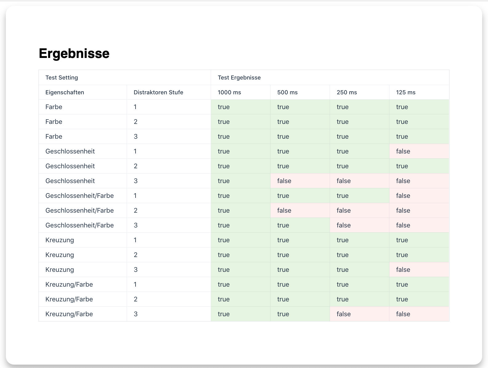
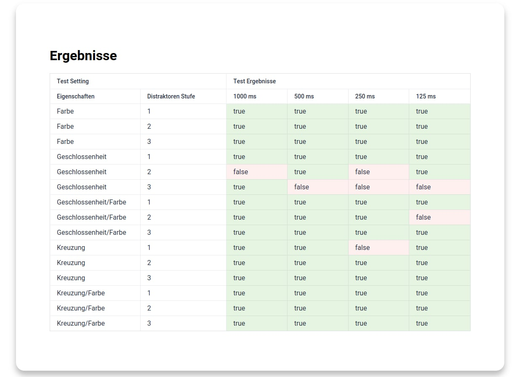

# Exercise 2

Präattentive Wahrnehmung von verschiedenen Objekteigenschaften

## Demo

[Demo on Firebase](https://pre-attentive-processing.web.app/)

## Run locally

```bash
# install dependencies
$ npm install

# serve at localhost:8080
$ npm run dev
```

# Visualized example data


